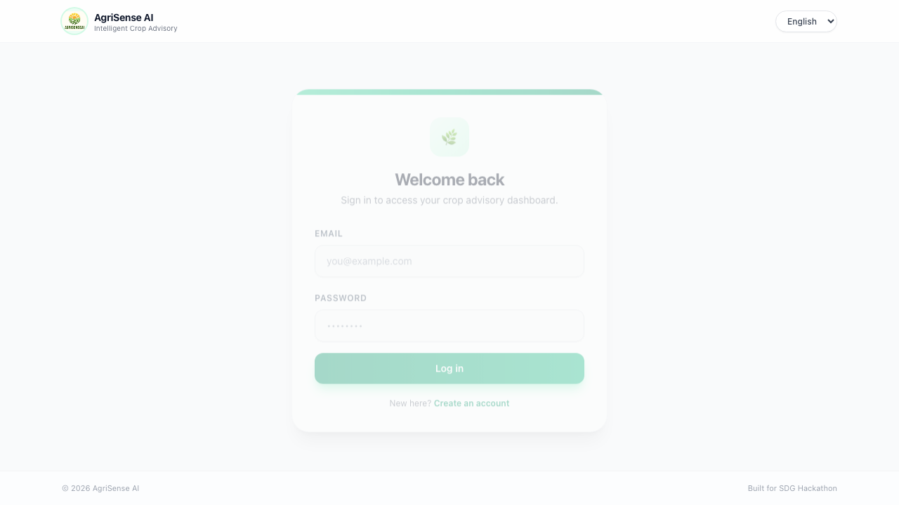
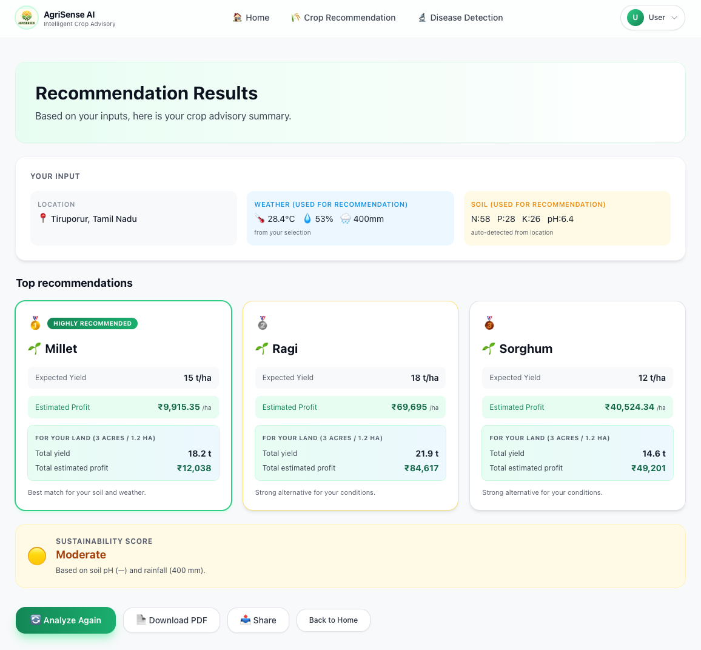
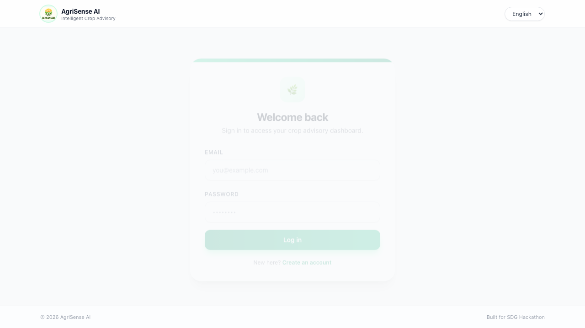

# 🌱 AgriSense AI

> **Intelligent Crop Advisory System** providing farmers with data-driven insights for crop recommendation, yield prediction, profit estimation, and disease detection.



## 🌟 Key Features

- **🌾 Crop Recommendation**: Recommends the most suitable crop based on soil nutrients (N, P, K, pH) and weather conditions (Temperature, Humidity, Rainfall) tied to your location.
- **📈 Yield Prediction**: Estimates potential crop yield (kg/ha) to help with harvest planning.
- **💰 Profit Estimation**: Calculates expected revenue and profit using real-time mock price data and estimated costs.
- **🦠 Disease Detection (YOLOv8)**: Upload an image of a leaf to instantly identify potential diseases and receive actionable treatment advice.
- **🧑‍🌾 Farmer-Friendly Advisory**: Simple input forms designed for ease-of-use, which auto-detect soil profiles and weather by region.

## 🤖 Machine Learning Models & Training

AgriSense uses two distinct machine learning pipelines to provide accurate recommendations:

### 1. Crop Recommendation Model
- **Algorithm**: `RandomForestClassifier` (exported as `crop40_brain1.joblib`)
- **Training Process**: The model was trained on an agricultural dataset containing 40 different crop classes. The features used for training included soil nutrients (Nitrogen, Phosphorous, Potassium), soil pH, and expected climate factors (Temperature, Humidity, Rainfall).
- **Feature Engineering**: To improve prediction accuracy, three additional derived ratios were engineered during training and prediction: `N/P`, `N/K`, and `P/K`. The model calculates risk-adjusted profit using live market prices.

### 2. Plant Disease Detection Model
- **Algorithm**: `YOLOv8 Classification` (exported as `best.pt`)
- **Training Process**: The model was fine-tuned on a large dataset of plant leaves—specifically trained to recognize 37 distinct plant disease classes across various species (e.g., Apple Scab, Corn Blight, Tomato Late Blight).
- **Implementation**: Real-time image classification processes uploaded leaf photos, mapping the identified disease to a curated database of actionable treatment advice.

## 📸 Screenshots

### Farmer Advisory & Crop Recommendation


### Plant Disease Detection


## 🛠 Tech Stack

- **Frontend**: React 18, Vite, Tailwind CSS, React Router
- **Backend**: FastAPI, Python 3.12+
- **Machine Learning**: 
  - Random Forest / xgboost for Crop Prediction & Yield Estimation
  - **YOLOv8** for High-Accuracy Plant Disease Detection

## 🚀 Getting Started (Local Development)

### 1️⃣ Clone the Repository

```bash
git clone https://github.com/RYuK-999/AgriSense.git
cd AgriSense
```

### 2️⃣ Start the Backend

```bash
cd backend
python -m venv venv
source venv/bin/activate  # On Windows, use `venv\\Scripts\\activate`
pip install -r requirements.txt

# Start the FastAPI Server
uvicorn main:app --reload
```
The backend API will run on `http://localhost:8000`. API documentation is available at `http://localhost:8000/docs`.

### 3️⃣ Start the Frontend

In a new terminal, navigate to the project root (where `package.json` is located):

```bash
npm install
npm run dev
```

The React frontend will be accessible at `http://localhost:5173`.

---

*Built for the SDG Hackathon.*
